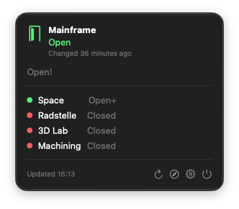
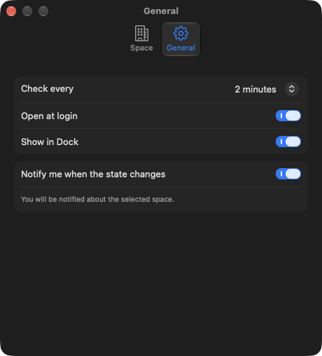
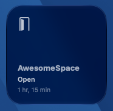
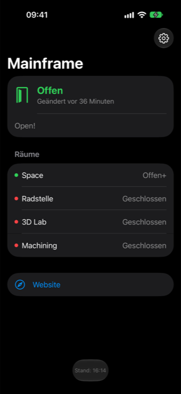

# SpaceState

Shows whether a hackerspace is open – in the macOS menu bar, on iOS and in widgets on both.

Any space listed in the [SpaceAPI directory](https://spaceapi.io) works. For [Mainframe Oldenburg](https://www.kreativitaet-trifft-technik.de) the app also shows its rooms (Radstelle, 3D Lab, Machining) and finer states such as "members only" or "closing".

Project status, decisions and next steps: [docs/PROJECT.md](docs/PROJECT.md).

## Features

### Everywhere

- Any space from the SpaceAPI directory, searchable by name and address; Mainframe Oldenburg is the default.
- Open, closed or unknown at a glance, with the time of the last change and the space's status message.
- Mainframe's rooms (Space, Radstelle, 3D Lab, Machining) with their own states.
- Push notifications when the selected space opens or closes, sent by [SpacePush](https://github.com/kerker00/SpacePush).
- State is read through SpacePush, with direct SpaceAPI requests as fallback.
- English and German.
- Anonymous usage statistics for SpacePush: the apps send a random install ID, created on first launch and tied to nothing else, and their version and OS version. SpacePush stores only a keyed hash of the ID and keeps just the counts after 40 days; see [SpacePush's statistics](https://github.com/kerker00/SpacePush#statistics).

### macOS

- Menu bar item with the current state; a click opens a panel with details, rooms, the space's website, refresh and settings.
- Settings: space, check interval, open at login, Dock icon, notifications.
- Clicking a notification (or the Dock icon) opens the status in a regular window.
- Desktop and Notification Center widgets (small and medium).

### iOS

- Status screen with rooms, status message and a link to the space's website.
- Settings sheet with space search and notifications.
- Home screen widgets (small and medium) and lock screen widgets (circular, rectangular, inline).

Each widget chooses its own space, so several widgets can show different spaces.

## Screenshots

| macOS menu bar | macOS settings | macOS widget |
| --- | --- | --- |
|  |  |  |

| iOS (German) |
| --- |
|  |

## Requirements

For the Apple apps:

- macOS 26 / iOS 26
- Xcode 26 or later

The underlying [SpaceStateKit package](SpaceStateKit/README.md) requires Swift 6.2 or later. Linux support is planned and has not yet been verified with a Linux build and test run.

## Structure

| Path | Contents |
| --- | --- |
| `SpaceStateKit/` | Swift package: `SpaceAPI` (generic SpaceAPI client) and `MainframeStatus` (Mainframe extras) |
| `Shared/` | App code shared by macOS and iOS |
| `macOS/` | Menu bar app |
| `iOS/` | iOS app |
| `Widget/` | WidgetKit extension for both platforms |
| `Config/` | Info.plist additions and entitlements |
| `docs/` | Project status and screenshots |

## Build

Open `SpaceState.xcodeproj` and run the `SpaceState-macOS` or `SpaceState-iOS` scheme.

Package tests:

    cd SpaceStateKit && swift test

## Linux and package extraction

When the API stabilizes, the generic `SpaceAPI` library is intended to move into its own repository, with Linux support tested from the start. The current library uses Foundation and has no SwiftUI, AppKit or UIKit dependencies. `MainframeStatus` remains a separate, optional module for Mainframe's rooms and extra states.

The first useful Linux application would be a command-line tool for finding spaces and querying their status, with human-readable and JSON output. This would let the community integrate it into status bars, scripts and displays in a hackerspace. Distributing Linux binaries would make the tool accessible to users who do not develop in Swift.

A Linux desktop interface would be a separate client using the same library. The existing Apple apps use SwiftUI; Linux desktop integration and local notifications belong in the Linux client.

See [SpaceStateKit's Linux plan](SpaceStateKit/README.md#linux-support-plan) for the required portability changes and verification.

## License

MIT, see [LICENSE.MD](LICENSE.MD).
